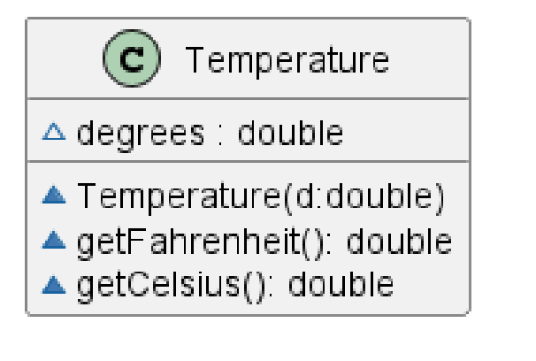
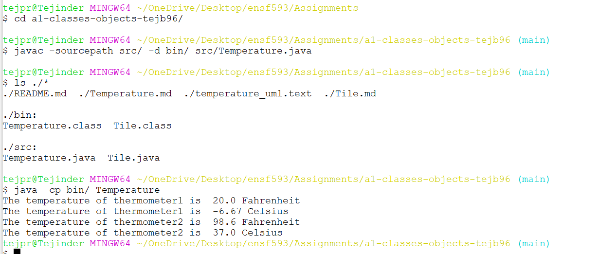

# Temperature report
Author: Tejpreet Bal

## UML class diagram

## Specification
This class Temperature contains a temperature in Fahrenheit and is able to return it as is or in Celsius.

## Execution and Testing

