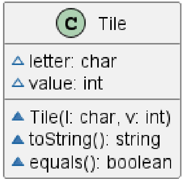

# Tile report
Author: Tejpreet Bal

## UML class diagram

## Specification
 This class contains a letter and number pair, which can be converted to a string and also compared to other objects of type Tile.

## Execution and Testing

# Reflection
I liked the Problem Decomposition sections in the README.md file, because they were really easy to follow.  
Something I was confused about was if the code execution has to be done in the terminal using commands or if it can be done by using the play button.
